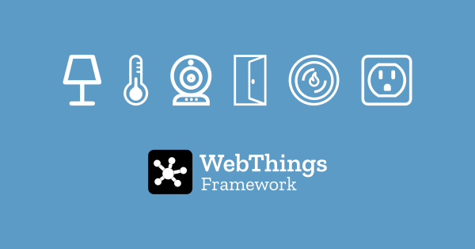

# WebThings Framework

*Build your own web things.*

The [WebThings Framework](https://webthings.io/framework/) is a collection of re-usable software components to help developers build their own web things.

This section contains installation instructions and examples showing how to create a web thing in a range of different programming languages.

**🗒️ Note:** *Most of these libraries implement Mozilla's legacy [Web Thing API](https://webthings.io/api/) and have not yet been updated to conform to the latest [W3C WoT standards](https://www.w3.org/WoT/). Contributions to bring these libraries up to date are gratefully received on [GitHub](https://github.com/WebThingsIO/).*