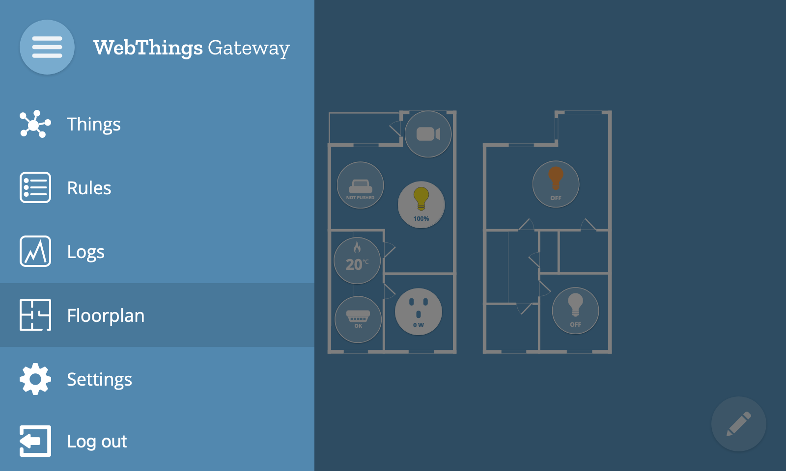
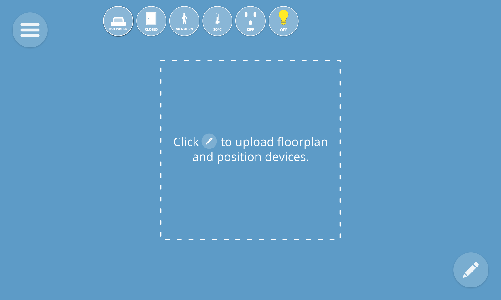
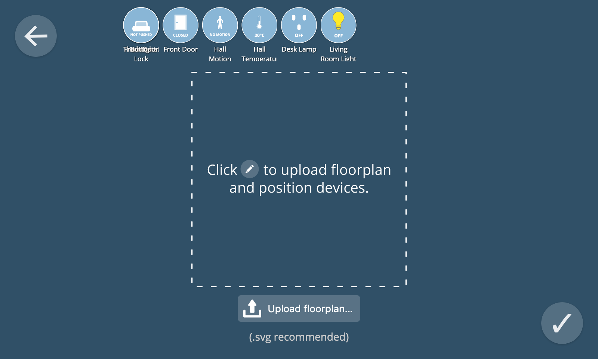
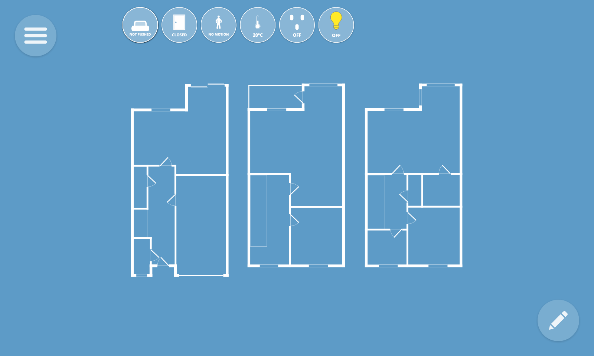
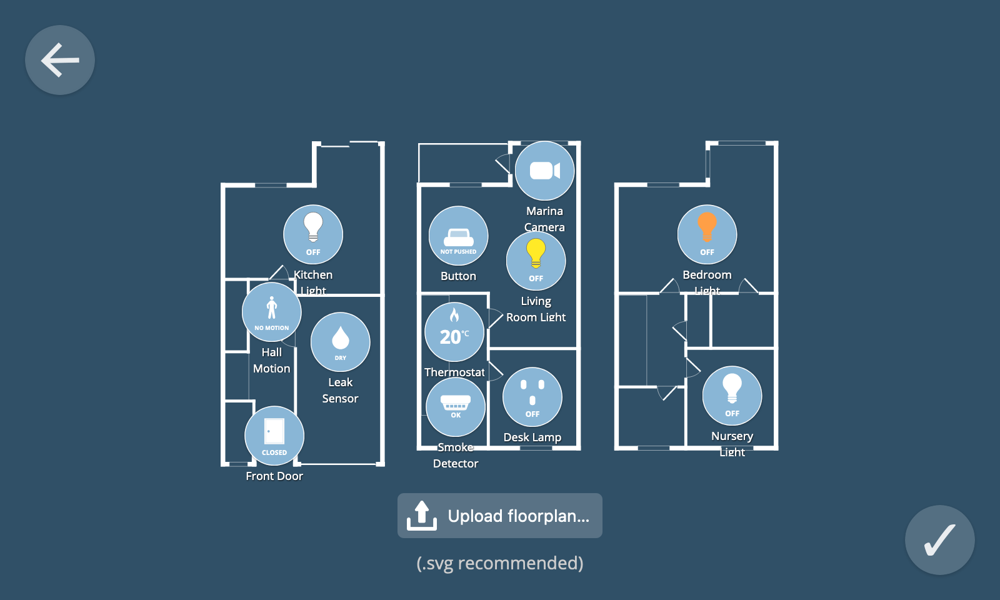
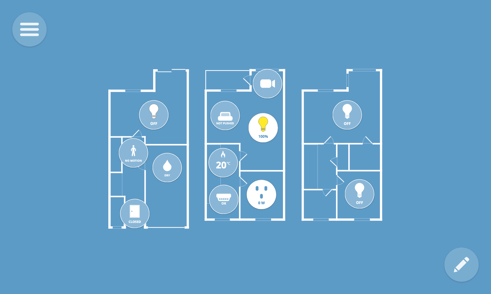
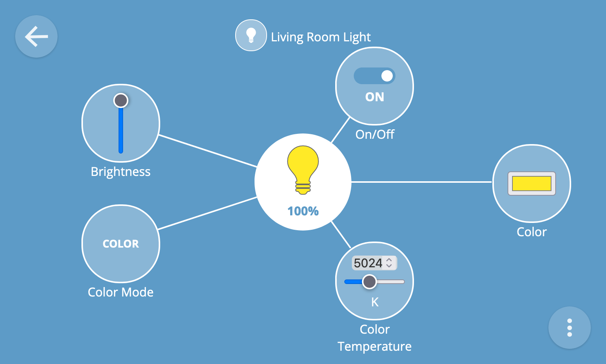

# Floorplan

The floorplan view enables you to lay out your things on an interactive floorplan of your home.

To navigate to the floorplan view, select the "Floorplan" option in the main menu.

## Upload Floorplan

The first time you view the floorplan view you will see all your things un-arranged in a row at the top of the screen.

To upload a floorplan of your home, first click on the "✎" button at the bottom right of the screen to enter the edit floorplan view.

From the edit floorplan view, click the "Upload floorplan..." button to upload a floorplan image of your home.

**💡 Tip:** You can upload any image file that can be rendered by web browsers including scanned images or even a photograph. For best results we recommend an SVG file with white lines and a transparent background.

Once you have uploaded your image, click the "✔" button at the bottom right of the screen to exit the edit view.

## Re-arrange Things

To arrange your things on the floorplan, first click the "✎" button at the bottom right of the screen.

You can then drag and drop the things into position on the floorplan.

Once you have finished re-arranging things, click the "✔" button at the bottom right of the screen to exit the edit view.

## Monitor & Control Things

The thing icons in the floorplan view show a live overview of their current state.

You can toggle things on and off from the floorplan view by clicking them.

To navigate to the detail view for a particular thing, long press its thing icon.

