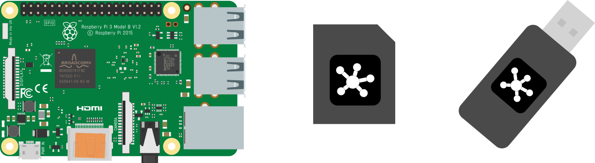
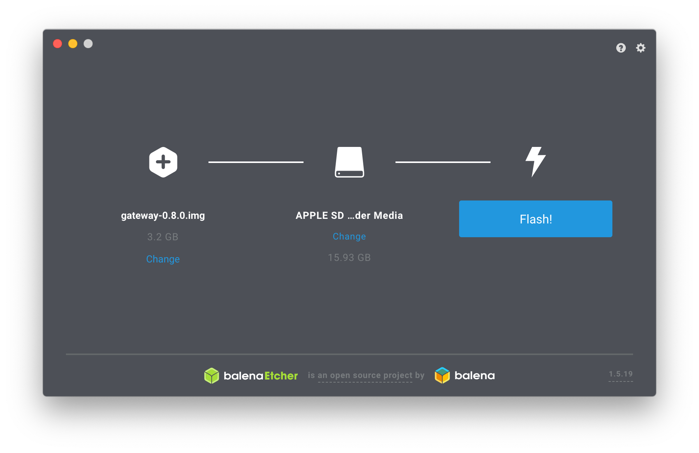
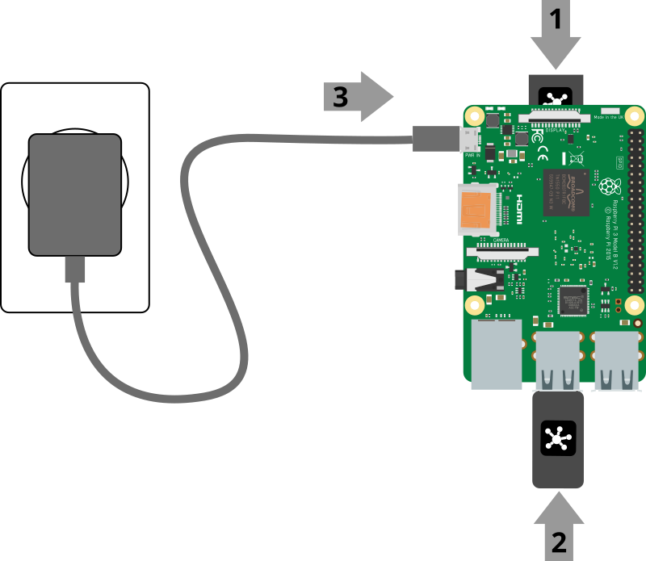

# Installation

The recommended ways to install WebThings Gateway are to either use a pre-built OS image for a [Raspberry Pi](#raspberry-pi), or install the [Docker](#docker) image. Alternatively you can [build it from the source code](https://github.com/WebThingsIO/gateway/blob/master/README.md#prerequisites-for-building) yourself.

## Raspberry Pi

To install WebThings Gateway on a Raspberry Pi you will need:

1. A **[Raspberry Pi®](https://www.raspberrypi.com/products/)** single board computer (Raspberry Pi 3 or 4 recommended, Pi 5 not yet supported) and power supply
2. A **microSD card** (At least 8GB, class 10 recommended)
3. **USB dongles** (Optional, see the list of [supported hardware](../supported-hardware))

**🗒️ Note:** The Raspberry Pi 3 and 4 come with Wi-Fi and Bluetooth radios. The USB dongles are needed if you want to support other smart home protocols like Zigbee and Z-Wave.

### 1. Download Image

First download the latest gateway image from the [WebThings website](https://webthings.io/gateway/).

### 2. Flash Image

Next you will need to flash the downloaded image onto your microSD card. There are [various methods](https://www.raspberrypi.com/documentation/computers/getting-started.html) of doing this but we recommend using [Etcher](https://etcher.balena.io/).

1. Open Etcher
2. Insert your SD card into an SD card reader attached to your computer
3. Select the downloaded image as the source file
4. Select your SD card as the target
5. Click "Flash!"

Once flashing is complete, remove the microSD card.

### 3. Boot Raspberry Pi

1. Insert the flashed microSD card into your Raspberry Pi
2. Plug in any USB dongles
3. Connect the power supply to boot the Pi
4. Check that the LEDs light up: red indicates power, green indicates activity
5. Wait a few minutes for the software to boot

**🗒️ Note:** On first boot the Raspberry Pi may take an additional 2-3 minutes longer to boot in order to take care of some first time setup.

## Docker

To install WebThings Gateway on Docker, follow the [instructions on Docker Hub](https://hub.docker.com/r/webthingsio/gateway).