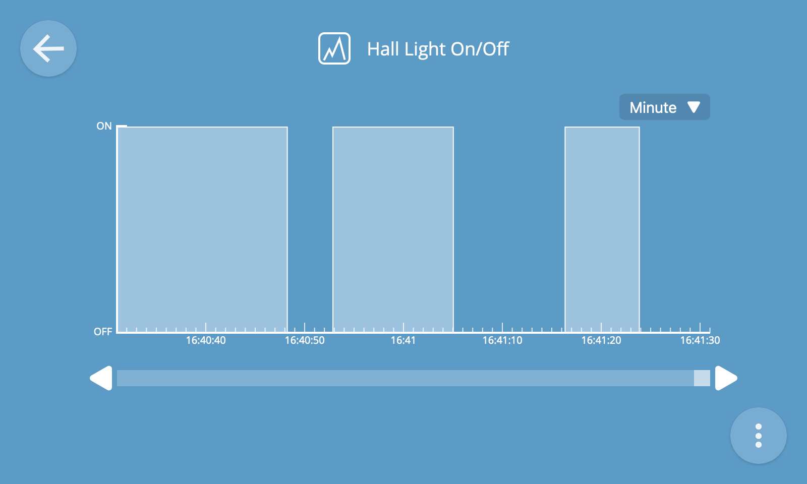

# Logs

The logging screen can be used to log values of properties over time and visualise that information on a graph.

To navigate to the logs screen, choose the "Logs" option from the main menu.

## Add Log

To add a log, click the "+" button at the bottom right of the screen.

You will then see the new log screen.

1. Choose a device whose property you would like to log
2. Choose a numerical or boolean property you would like to log
3. Choose how long you would like to retain logged data for before it is automatically deleted
4. Click the "Save" button

You will then be navigated to the view logs screen, with an empty graph representing the log you just created.

**⚠️ Warning:** If saving logs to an SD card (e.g. on a Raspberry Pi), writing large quantities of data can shorten the life of your memory card.

## View Logs

To view an individual log full screen, click its title from the view logs screen.

The data in the log is represented as a line graph. You can set the timescale of the graph to "minute", "hour", "day" or "week" depending on the duration you'd like to view at any one time. You can then scroll through the logged data using the scrollbar at the bottom.

Both numerical and boolean (true/false) types of property can be logged.

The x axis will show the timescale, and the y axis will show the range and unit of the values.

Logs are updated in real time, which you will notice when viewing the "Minute" time resolution because the graph will animate across the screen.

**💡 Tip:** You can hover over a data point to view its exact timestamp and value.

## Remove Log

To remove a log, from the view log screen click the overflow menu at the bottom right of the screen and click the "Remove" option.

You will then be shown a confirmation dialog which will confirm that you want to permanently delete the log.

**⚠️ Warning:** Removing a log will also permanently delete all of its data.

