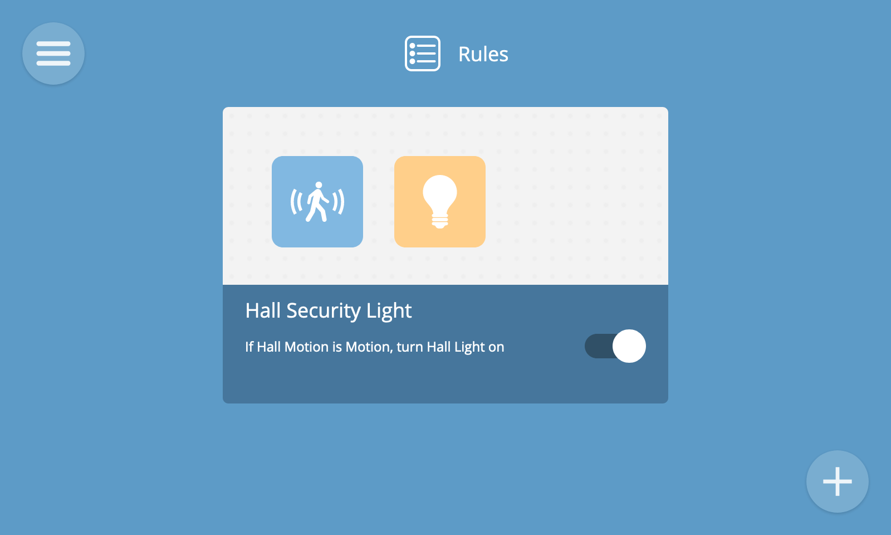

# Rules

The rules screen provides a drag and drop graphical user interface to create "if this then that" style rules to automate your home.

For example, if you want a light to turn on when motion is detected in a room, or sound an alarm when a door is opened.

To navigate to the rules screen, select the Rules option from the main menu.

## Add Rule

To create a rule, click the "+" button at the bottom right hand corner of the screen.

You will then see the new rule screen where you can choose one or more inputs, one or more outputs and give the rule a name.

Properties and events of devices can be used as inputs, and properties and actions can be used as outputs.

### Input and Output

First, drag and drop a device from the collection of devices at the bottom to the left hand side of the rule area to choose the input device for the rule.

Next, drag and drop a device from the collection of devices at the bottom to the right hand side of the rule area to choose the output device for the rule.

Next, choose the input property or event which will trigger the rule. 

**💡 Tip:** As well as device properties and events, you can also use time as an input to trigger a rule at a particular time of day. To do this, drag and drop the the built-in "Clock" device as an input.

**🗒️ Note:** For numerical properties you can choose a threshold above or below which the rule is triggered.

Next, choose the output property value or action to use as an output. 

**🗒️ Note:** For numerical properties you can specify the precise value to set the property to when the rule is triggered.

Finally, provide a name for the rule by clicking on "Rule Name" at the top of the screen and editing the name.

You will now see the completed rule, with a line linking the input and output as well as a textual description of the rule.

Click the back button at the top right of the screen to go back to the rules screen and you'll see your new rule has been created.

### If/While

By default, rules use an "if" conditional which is triggered when a property transitions to a given value or an event is emitted. There is also a subtly different "while" conditional.

If you want an output condition to continue until an input condition stops being true, but then revert back to its previous state (e.g. for a light to remain illuminated whilst a button is pressed), then you can instead choose the "while" option in the textual description of the rule.

### And/Or

When selecting multiple inputs for a rule, you can choose whether all conditions need to be true for the rule to be triggered, or just one of them.

To only trigger the rule if all of the input conditions are true, select the "and" option in the textual description of the rule.

To trigger the rule if any of the input conditions are true, select the "or" option in the textual description of the rule.

## View Rules

To view all of your rules, select the "Rules" option from the main menu.

Each rule is represented by a card which shows the name and description of the rule and icons illustrating the inputs and outputs it uses.

A rule can be toggled on and off using the on/off button. This can be useful for temporarily enabling or disabling a rule (e.g. to arm or disarm an alarm system).

**🗒️ Note:** If a rule is missing a valid input or output, or one of the devices used as an input or output has been removed from the gateway, the rule may show as "invalid".

## Edit Rule

To edit a rule, hover over its card in the rules view and click the "Edit Rule" button.

This will take you to the edit rule screen, which is the same as the new rule screen.

Once you have finished editing ther rule, click the back button to go back to the rules screen. Your changes will be saved automatically.

## Remove Rule

To remove a rule you can either hover over its card in the rule screen and press the "x" button, or press the trash can icon in the edit rule screen.

Either way you will be shown a remove rule confirmation dialog. Click "Remove Rule" to delete it.

