# Settings

The settings view enables you to customise the settings of your gateway device.

To navigate to the settings view, select the "Settings" option from the main menu.

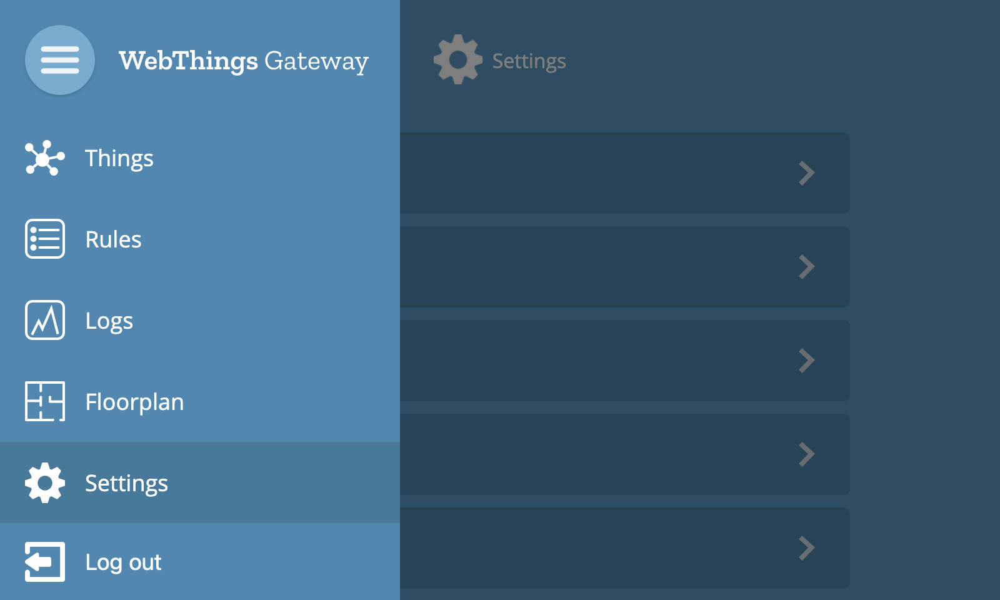

You will then see the settings menu, which lists the different types of settings that can be configured:

- [Domain](#domain)
- [Network](#network)
- [Users](#users)
- [Add-ons](#add-ons)
- [Localisation](#localisation)
- [Updates](#updates)
- [Authorisations](#authorisations)
- [Experiments](#experiments)
- [Developer](#developer)

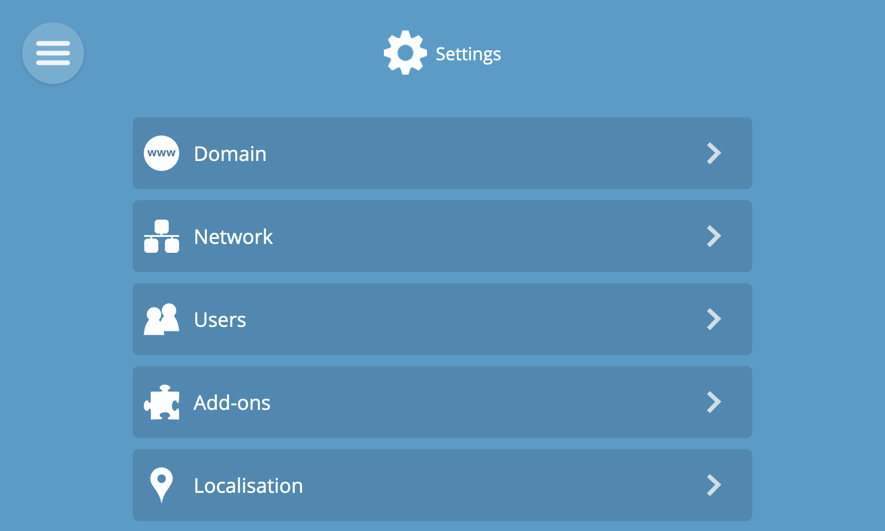

**🗒️ Note:** The available settings will vary slightly depending on which platform (hardware and operating system) you are running the gateway application on. 

## Domain

The domain settings allow you to customise how your gateway is accessed on local and remote networks.

### Local Access

By default, your gateway will be accessible on your local network at the  "gateway.local" local domain.

To edit the local domain type a new value into the text box and click "Update host name".

To disable access via a local domain, un-tick the "Local Access" checkbox.

**🔧 Technical Note:** The local domain is broadcast using mDNS/DNS-SD. Not all operating systems (e.g. some versions of Microsoft Windows) support this out of the box , so you may need to install additional software on your client device in order to access the gateway's local domain.

### Remote Access

The remote access section tells you whether the webthings.io remote access service is configured on this gateway, to provide a secure tunnel to remotely access the gateway over the internet using a custom subdomain.

If the remote access service has been configured, then the custom subdomain will be displayed here.

**🗒️ Note:** It's not currently possible to configure the remote access service after first time setup.

**🔧 Technical Note:** For technical information about how the remote access service works, see [here](https://github.com/WebThingsIO/registration_server/blob/master/doc/flow.md).

## Network

Network settings allow you to configure the local networks your gateway is connected to via Ethernet and Wi-Fi.

The Network Settings screen shows an overview of current network settings, including any IP addresses assigned to the gateway, and the name of the Wi-Fi network (if any) the gateway is connected to.

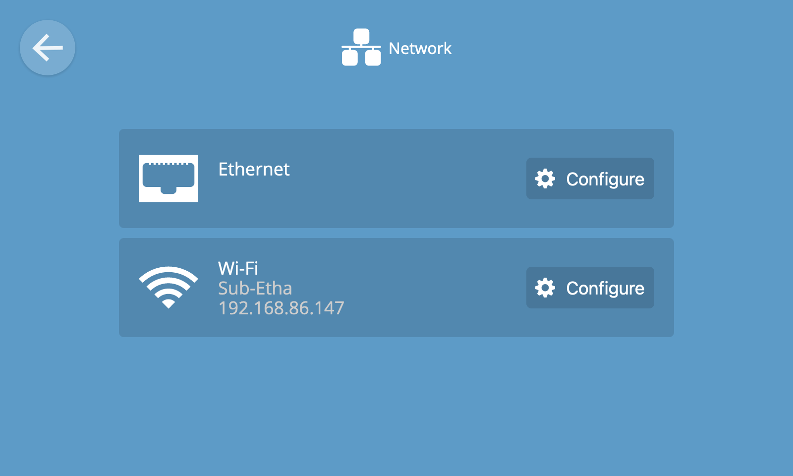

### Ethernet

To configure Ethernet settings, click the "Configure" button under the Ethernet section of the Network Settings view.

By default the gateway will automatically request a local IP address from a DHCP server.

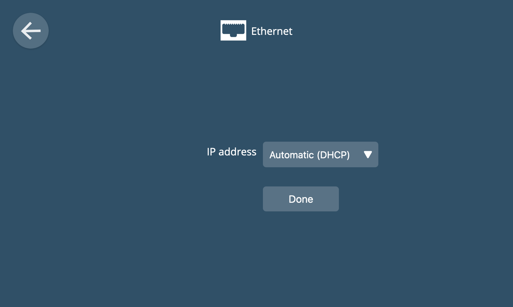

If you want to you can choose to manually set an IP address instead by choosing the "Manual (Static IP)" option.

**⚠️ Warning:** Please only change these settings if you know what you are doing. If you configure a static IP address incorrectly, it may render the gateway inaccessible on the local network. You will then need to re-configure the network settings manually on the command line.

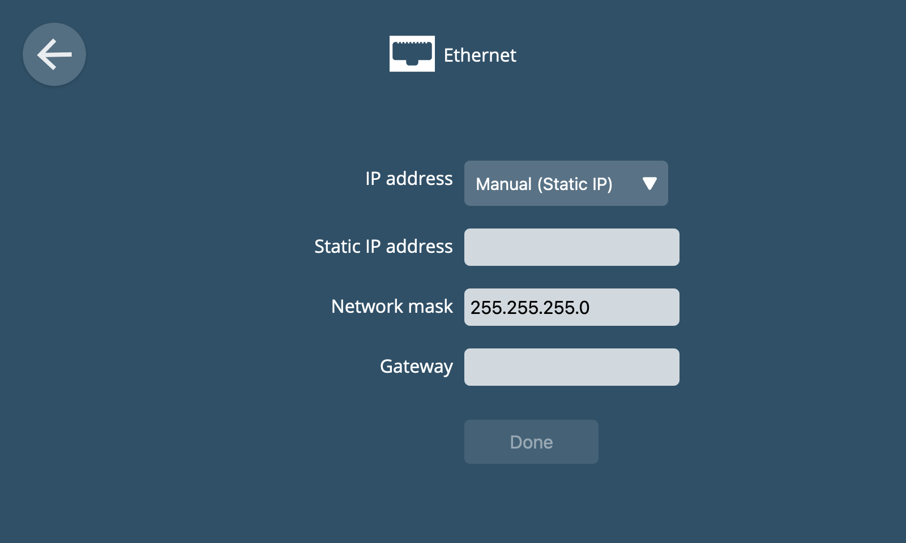

### Wi-Fi

To configure Wi-Fi settings, click the "Configure" button under the Wi-Fi section of the Network Settings view.

The Wi-Fi settings view will display a list of Wi-Fi networks that can be detected nearby, including their signal strength and whether they are open or secured.

If the gateway is connected to one of these networks it will say "Connected" in green writing.

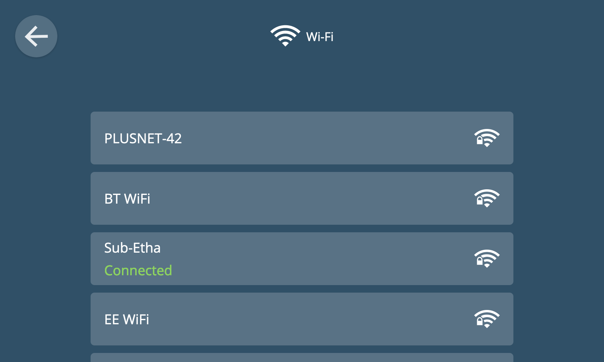

To connect to a Wi-Fi network, click on its entry in the list. If the network requires a password or pass key, you will be prompted to enter one before clicking "Connect".

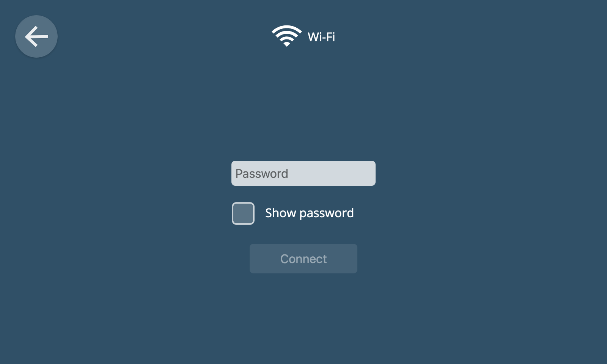

**🗒️ Note:** If the gateway fails to connect to the configured Wi-Fi network, it may switch to the Wi-Fi hotspot mode from first time setup to enable you to re-connect to a Wi-Fi network.

## Users

The users screen allows you to manage user accounts of people who have access to the gateway.

You will have created the first user account during first time setup, but you can add as many user accounts as you like.

### View Users

The users screen shows a list of user accounts and their names and email addresses.

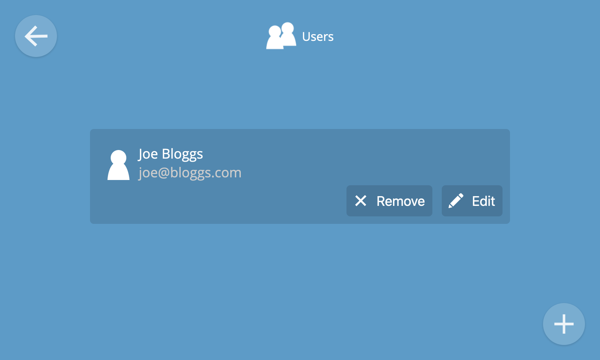

### Add User

To add a user account, click the "+" button at the bottom right of the Users screen.

You will then be prompted to enter a name, email address, password and password confirmation, before clicking "Save".

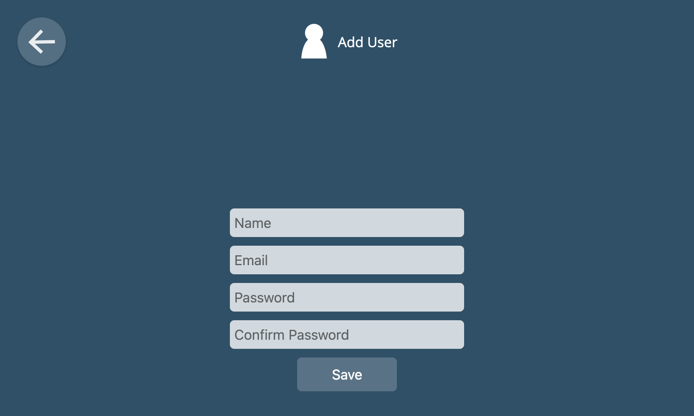

The new user will then appear on the list of users on the users screen.

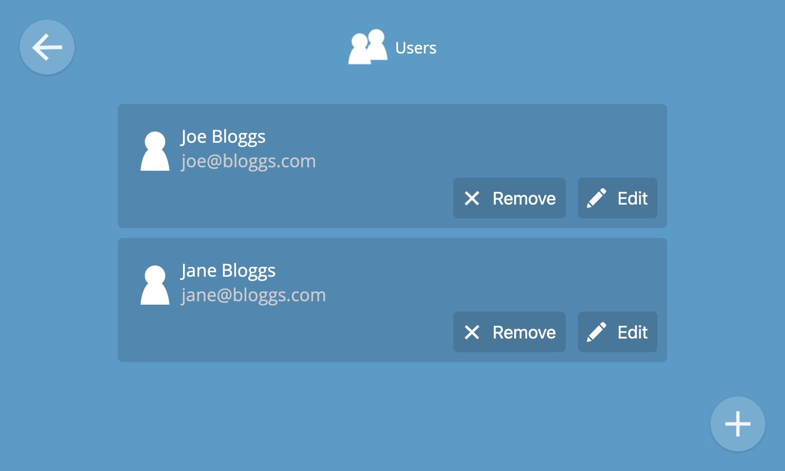

**🗒️ Note:** Currently all user accounts are given equal and full access to the gateway, including the ability to add and remove other users. Only provide a user account to someone you trust.

### Edit User

To edit a user account, click the "Edit" button on its item in the list of users.

You can change the name and email address of the user by editing the corresponding text fields.

To change the user's password you will need to enter their current password, a new password, and confirmation of the new password.

Once you have finished making changes, click the "Save" button.

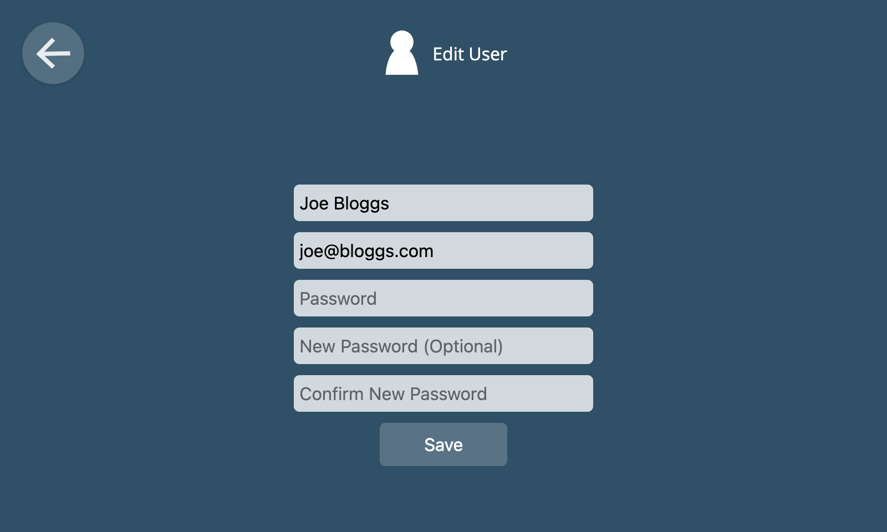

#### Two-factor Authentication

To enable two-factor authentication for the user as an additional layer of security, click the "Enable two-factor authentication" checkbox at the bottom of the Edit User screen.

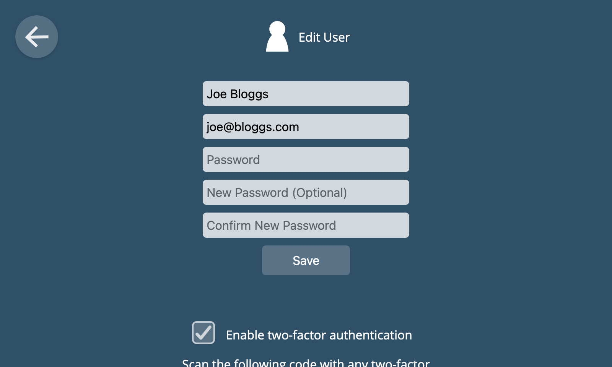

You will then be presented with a QR code to scan in your two-factor authenticator app.

If the QR code doesn't work, you can use the TOTP secret text string instead.

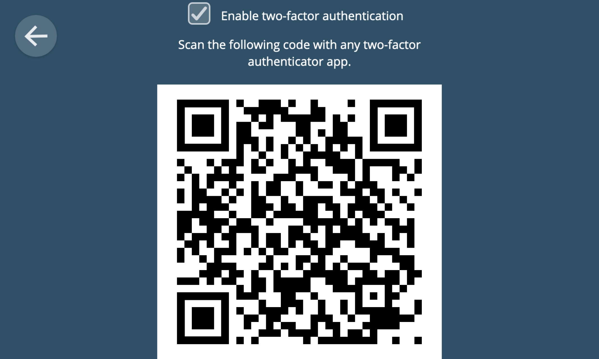

You will need to enter the code produced by your authenticator app in the provided text box and click "Verify" to confirm.

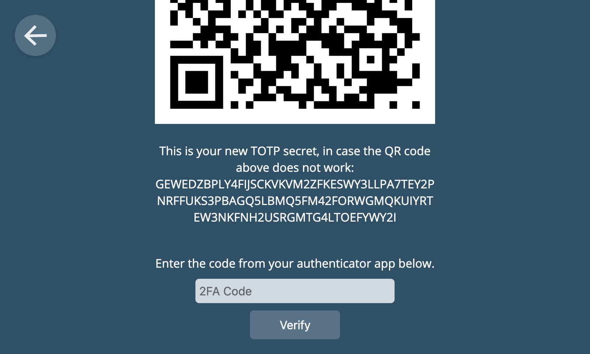

From this point on this user will need two-factor authentication to log in to their account.

### Remove User

To remove a user click the "Remove" button next to their entry in the users list.

**⚠️ Warning:** The user will be deleted immediately, with no confirmation and no way to undo the deletion.

## Add-ons

The gateway has an add-ons system which enables users to add additional capabilities or customisations. There are three different types of add-ons:

1. **Adapter Add-ons** - Add compatibility with additional types of devices or protocols
2. **Notification Add-ons** - Add additional mechanisms to send notifications to users
3. **Extension Add-ons** -  Customise the user interface of the gateway

By default only the Zigbee, Z-Wave and Web Thing adapter add-ons are installed but there are over a hundred other community-contributed add-ons to choose from.

**🗒️ Note:** The add-ons available in the add-ons directory are contributed by the WebThings community. To learn how to create your own add-on or contribute to an existing add-on, see [Add-on Development](../hacking#add-on-development).

### View Add-ons

To access the add-ons screen, select the "Add-ons" option from the settings menu. This screen shows a list of currently installed add-ons including their name, description, version number, author and license.

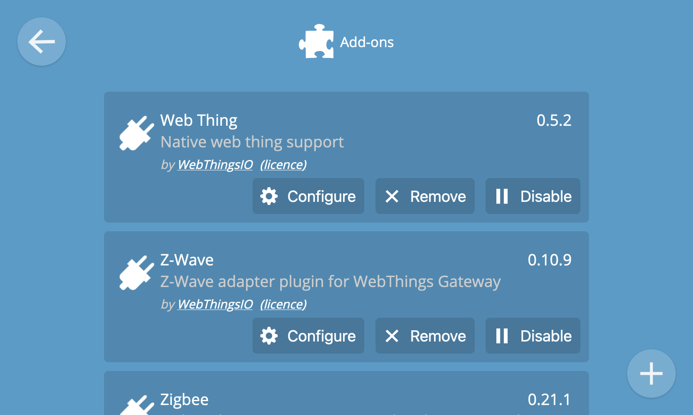

**🗒️ Note:** Add-ons are automatically updated when a new version is submitted to the directory by the add-on author.

### Add Add-on

To install an add-on, click the "+" button at the bottom right of the add-ons screen.

You will be presented with the latest list of available add-ons from the community maintained add-on directory.

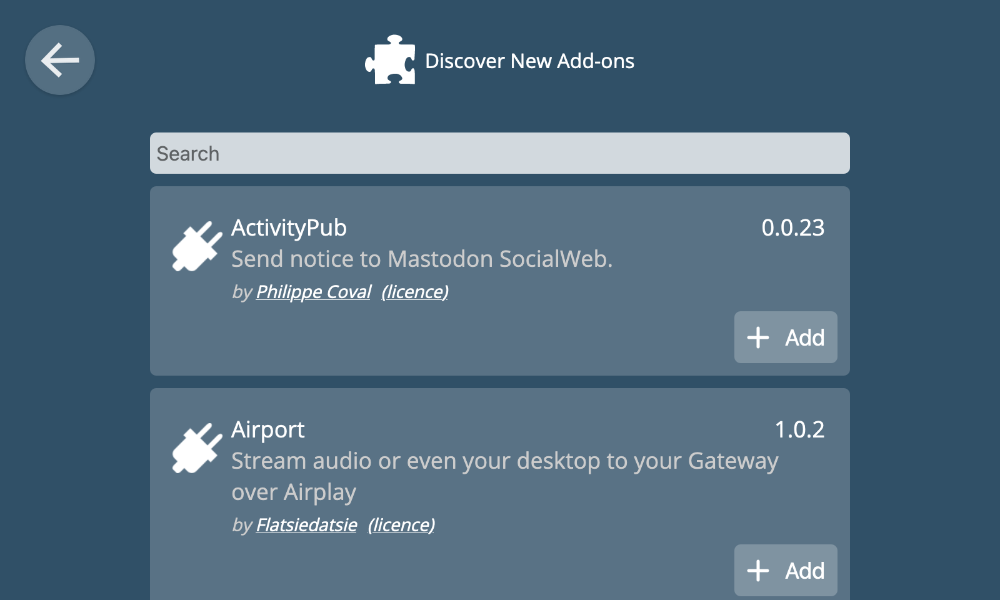

To install one of the available add-ons, click the "Add" button on its entry in the list.

**⚠️ Warning:** Whilst the communtity makes an effort to try to review new add-ons to check they do what they say they do, we can not guarantee that an add-on from the a third party is safe to use. It's up to users to decide whether they trust the author of any given add-on.

If you see the word "Added" instead of an "Add" button, it means that add-on has already been installed.

Whilst the add-on is installing you will see the word "Installing...".

Once the add-on has been successfully installed you will see the word "Added".

If you click the back button at the top left of the screen, you should then see the add-on you installed appear in the list.

**💡 Tip:** You can filter the names of add-ons by typing into the "Search" box at the top of the list.

### Enable/disable Add-on

You can temporarily disable an add-on by clicking the "Disable" button on its entry in the add-on list, and re-enable it again by clicking "Enable".

### Remove Add-on

To remove an add-on click the "Remove" button.

**⚠️ Warning:** Clicking the "remove" button will automatically remove an add-on without requiring any confirmation, which may result in the loss of data.

### Configure Add-on

Some add-ons have additional configuration options available via a "Configure" button. These options are unique to each add-on.

## Localisation

The Localisation section allows you to customise the gateway user interface to match your locale.

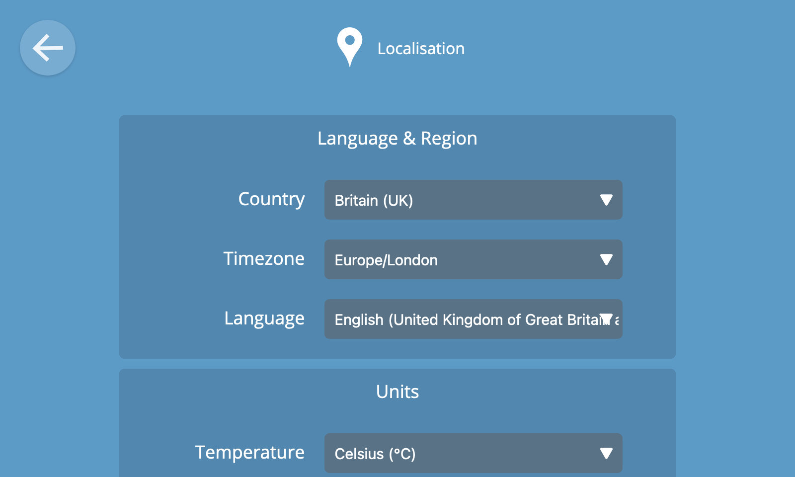

Configuration options include:

- **Country** - This is used, amongst other things, to set the country code in Wi-Fi settings
- **Timezone** - This is important to ensure that rules execute at the time you expect
- **Language** - This is used to customise the language used in the user interface
- **Units** - This is used to customise the preferred units used in the user interface

**🗒️ Note:** The WebThings Gateway user interface is translated into different languages (34 at the last count) by the WebThings community. You can contribute to these translations [here](https://pontoon.mozilla.org/projects/webthings-gateway/).

## Updates

The gateway supports automatic over-the-air updates whenever a new version of the gateway application is released.

To see what version your gateway is running, click on the "Updates" option from the Settings screen.

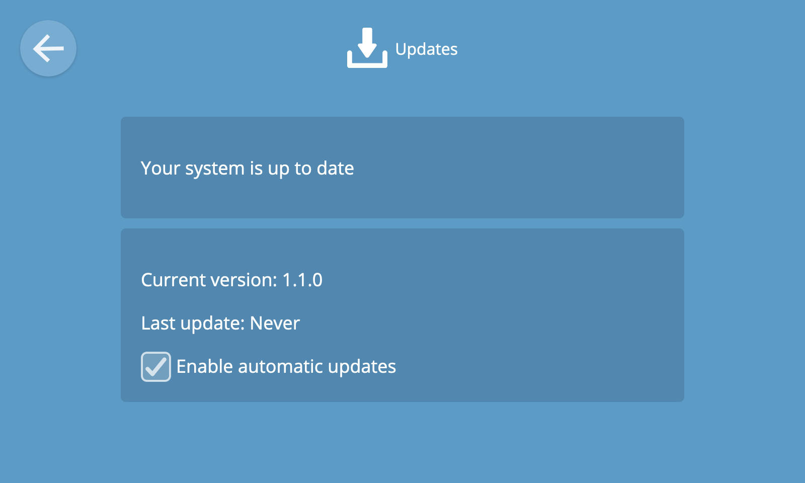

The Updates screen will tell you whether your gateway is up to date, or if a new version is available.

It will also tell you the current version your gateway is running and when it was last updated.

To disable automatic updates, un-tick the "Enable automatic updates" checkbox.

**💡 Tip:** We recommend that you keep automatic updates enabled so that you are always running the latest available version, which may include security fixes. Whilst it is possible to manually upgrade the gateway from the UI yourself, the process takes some time and users sometimes incorrectly think the process has frozen and reboot the gateway, which may leave it in a broken state.

**🗒️ Note:** This feature is currently only available for users who have installed WebThings Gateway using a Raspberry Pi OS-based image from our [website](https://webthings.io/gateway/).

**⚠️ Warning:** The automatic update system does not currently update the underlying operating system, only the gateway application. It is the user's responsibility to keep the operating system (e.g. Raspberry Pi OS) up to date with security fixes. See the [Raspberry Pi documentation](https://www.raspberrypi.com/documentation/computers/os.html#updating-and-upgrading-raspberry-pi-os) for how to update Raspberry Pi OS.

## Authorisations

It is possible to authorise third party web services to access the gateway's API (application programming interface), in order for them to provide additional functionality by monitoring and controlling devices via your gateway.

When a service requests access, you can choose whether they just monitor devices, or monitor and control them, and also choose exactly which devices they have access to.

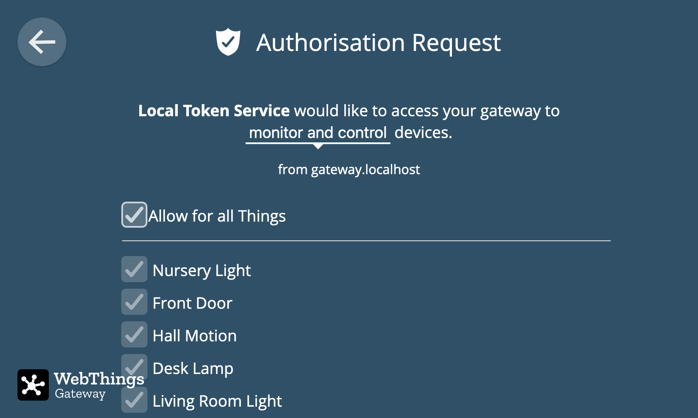

To view a list of services you have authorised to access your gateway, choose the "Authorisations" option in the settings menu.

You can revoke access from a given service at any time by clicking the "Revoke" button.

## Experiments

From time to time, the WebThings community will create new experimental features for users to try out before they are fully complete.

To see a list of experiments to enable or disable, click the "Experiments" option in the settings menu.

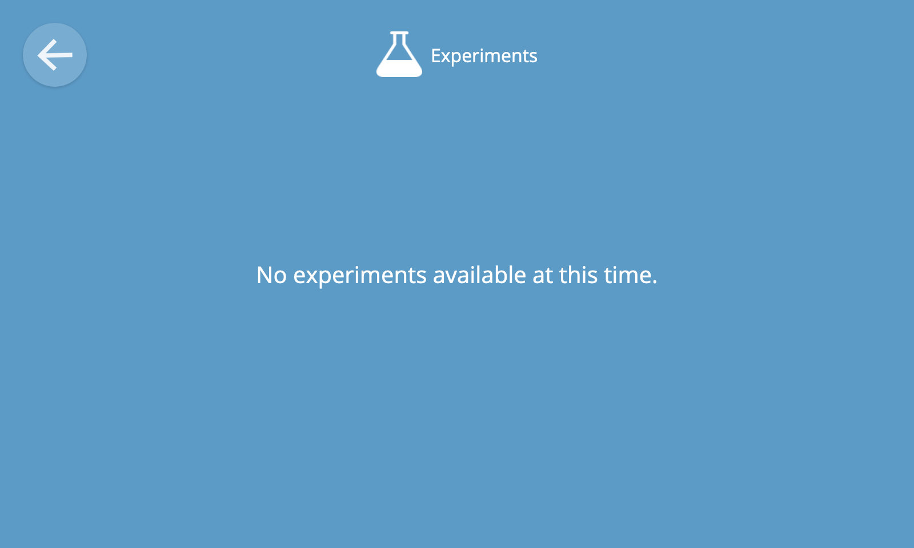

## Developer

**⚠️ Warning:** Here be dragons!

There some advanced settings available for developers including:

- Enabling command line access to the gateway on the local network via SSH
- Viewing internal system logs for use during debugging
- Issuing local API tokens (JSON Web Tokens) for use during development

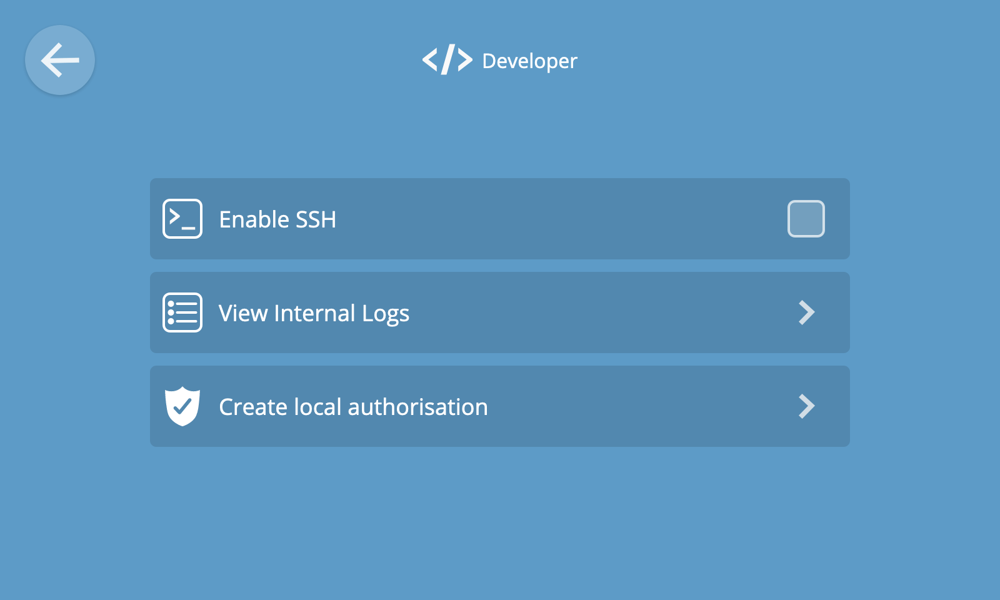

