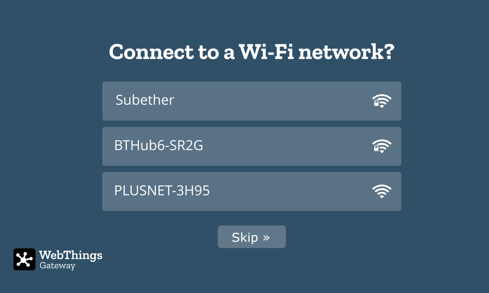
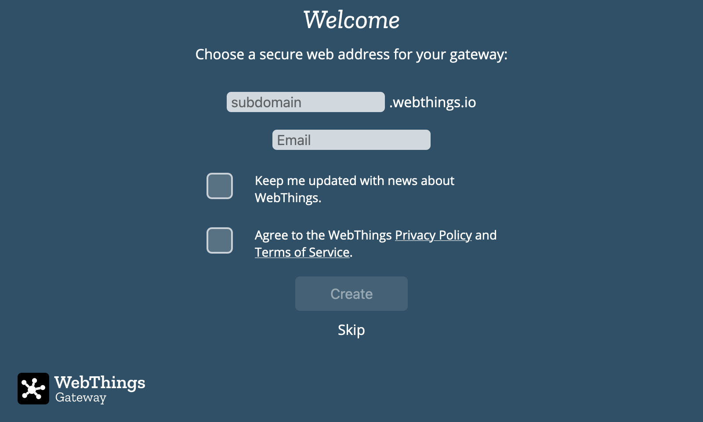
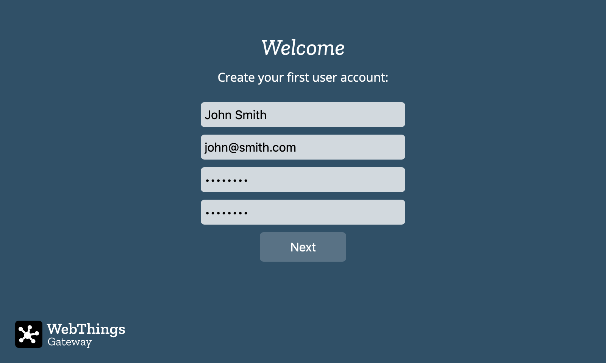

# First Time Setup

The first time your gateway boots it will require some configuration.

## 1. Connect Wi-Fi (Optional)

When the gateway starts up it will create a Wi-Fi hotspot called "**WebThings Gateway XXXX**" (where XXXX are four digits from your Raspberry Pi's MAC address). Use a smartphone, tablet or desktop computer to scan for and connect to that wireless network.

A captive portal page will appear, showing nearby Wi-Fi networks.

Select the desired network and enter a password if prompted. The "Connecting to Wi-Fi..." page should automatically disappear.

Or to skip connecting to a Wi-Fi network (if already connected via Ethernet), click the "Skip" button (you can reconfigure Wi-Fi later from [Settings](../settings)).

After you've connected your gateway to a wireless network, you should ensure that your smartphone, tablet or desktop computer is connected to the same Wi-Fi network and then navigate to [http://gateway.local](http://gateway.local) in your web browser to access the gateway's web interface.

**🗒️ Notes:** 

* If you are connected to the "WebThings Gateway XXXX" Wi-Fi network but you don't see the captive portal, you can try typing "http://192.168.2.1" into your web browser's address bar to manually navigate to the page.
* As an alternative to Wi-Fi, you can connect the Raspberry Pi to your home network using an Ethernet cable and it will attempt to automatically get an IP address from your router.
* If you're not able to access "http://gateway.local" (e.g. on Microsoft Windows), you may need to look up the IP address assigned to the Raspberry Pi by your router (look for a hostname of “gateway” or a MAC address starting with “b8:27:eb”), and type that into the address bar of your web browser instead.
- If neither "http://gateway.local" or "http://{IP ADDRESS}" will load in your browser, check to make sure your computer is definitely connected to the same network you connected the gateway to.
- If you move the gateway to another location and it can no longer access your home network, it will revert to access point mode so you can connect to it and re-configure a different network.

## 2. Register a Subdomain (Optional)

When you load "http://gateway.local" for the first time, you will be given the option to register a free subdomain to safely access your gateway over the Internet using a secure tunnelling service.

Enter your choice of subdomain and an email address in case you need to retrieve your subdomain later to re-install on a new gateway. You will also need to agree to the WebThings Privacy Policy and Terms of Service in order to use the back end services provided by the community. Click “Create” and wait a few moments for the subdomain registration to complete. You should then be redirected to your new subdomain.

**🗒️ Notes:**

- You can choose to skip this step (either to only use the gateway locally on your home network or manually configure DNS yourself), but note that currently if you do skip this step you’ll have to re-flash the gateway in order to register a subdomain
- If you have previously registered a subdomain you want to re-use, enter the subdomain and the email address you used to register it and follow the on-screen instructions to re-claim it

## 3. Create a User Account

The gateway will next prompt you to create your first user account. Enter a name, email address and a password and click "Next".

**🗒️ Note:** You can create additional user accounts later.

**Success!**

Once your user account has been successfully created, you will be automatically logged in to the gateway and you should see an empty Things screen, ready for you to start adding devices.

