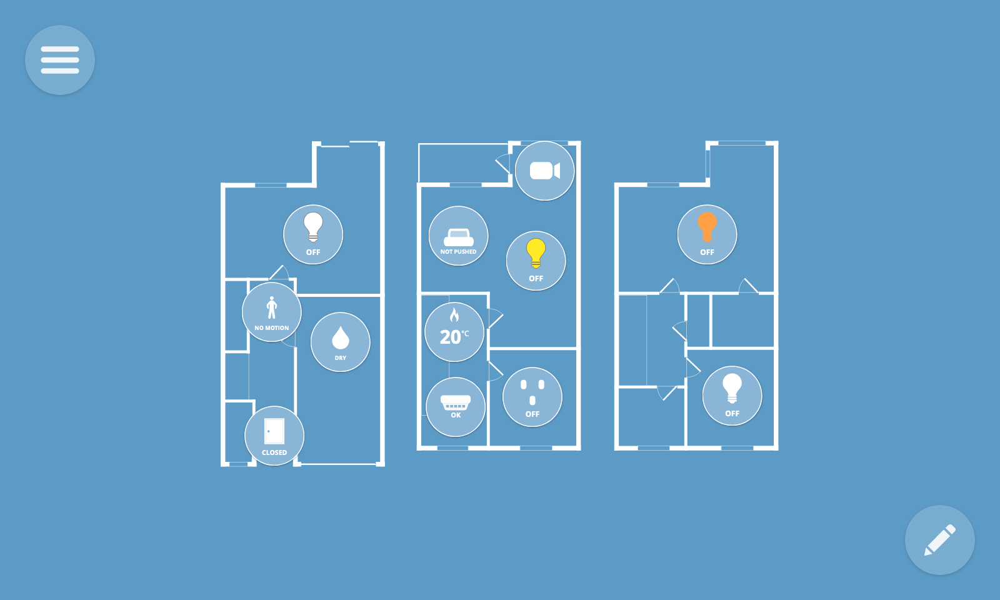

# WebThings Documentation

Welcome to the documentation for the [WebThings](https://webthings.io) project.

WebThings is an open platform for monitoring and controlling devices over the web.

## WebThings Gateway

*Host your own private smart home.*

[WebThings Gateway](gateway/introduction) is a software distribution for smart home hubs focused on privacy, security and interoperability. It enables you to securely monitor and control your home over the web, without a middleman.

## WebThings Framework

*Build your own web things.*

[WebThings Framework](framework/introduction) is a collection of re-usable software components to help developers build their own web things.

## W3C Web of Things

The [W3C Web of Things](wot/introduction) is the collection of open standards upon which the WebThings platform is built.

---

🛟 For support, please sign up to our [forum](https://discourse.mozilla.org/c/iot), chat with us in the [#iot:mozilla.org](https://matrix.to/#/#iot:mozilla.org) channel on Matrix, or post [issues](https://github.com/WebThingsIO/gateway/issues) on GitHub.
